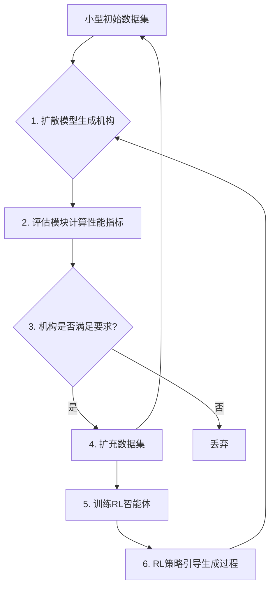

# GenRLMechSyn: 项目介绍 & 技术路线图

**版本:** 1.0
**日期:** 2025年10月24日

## 1. 项目愿景与目标

**GenRLMechSyn** (Generative Reinforcement Learning for Mechanism Synthesis) 项目旨在利用最前沿的人工智能技术，彻底改变传统机械机构的设计范式。

**痛点:** 传统的机构综合方法往往依赖于繁琐的数学推导、有限的设计库或大量的专家经验，难以高效地探索广阔的设计空间并发现真正新颖、高性能的机构。

**我们的愿景:** 构建一个能够**自主学习、自我演化、持续探索**的AI系统。该系统能够：
* 从极少量（甚至零）的初始样本出发。
* 利用生成模型（Diffusion Model）创造多样化的机构候选方案。
* 通过基于物理规则和性能指标的评估（奖励函数），筛选出有效的机构。
* 利用强化学习（RL）智能地引导生成过程，使其更倾向于产生高质量、满足特定要求的设计。
* 最终实现机构设计的自动化和智能化，加速创新过程。

**核心目标:** 开发并验证一个结合了**扩散模型 (DiT)** 和**强化学习 (RL)** 的闭环框架，用于高效、可控的机构综合设计。

## 2. 核心概念：模仿者-探索者 (Mimic-Explorer) 架构

本项目采用了一种“双引擎”协同工作的架构：

* **模仿者 (Mimic Engine): DiT + MSE 损失**
    * **角色:** “画师”或“结构学习者”。
    * **技术:** 基于当前SOTA的 **Diffusion Transformer (DiT)** 架构。
    * **目标:** **保真度 (Fidelity)**。通过`MSE`损失函数，学习训练数据集中所有*已知有效*机构的底层表示（像素/体素级分布）。它负责确保生成的机构在“形态”上是合理的、平滑的、有结构的，而不是随机噪声。
    * **训练:** 在包含初始种子数据和后续扩充的高分数据的**整个数据集**上进行监督学习（去噪任务）。

* **探索者 (Explorer Engine): RL Agent + Evaluator**
    * **角色:** “向导”或“物理学家”。
    * **技术:** 一个**奖励预测模型**（基于Transformer）作为`RL智能体`，以及一个**动态的、可配置的`评估器`**作为奖励函数。
    * **目标:** **有效性 (Validity) & 优化 (Optimization)**。`评估器`根据通用的物理规则（如自由度DoF=1）和特定的设计偏好（如拓扑相似性、节点数）给机构打分。`RL智能体`学习预测这个分数，并提供“引导梯度”，在DiT生成过程中“推动”其朝向更高分的方向探索。
    * **训练:** `RL智能体`使用生成过程产生的 `(机构, 最终分数)` 经验数据，通过策略梯度等方法进行强化学习训练。

这种架构允许系统在保持生成质量（来自DiT）的同时，有效地探索满足特定物理约束和性能要求（来自RL）的新颖设计。

## 3. 系统架构与工作流程

系统通过一个**三步循环**进行迭代优化：

1.  **[引导生成 (Guided Generation)]**: `DiT`（模仿者）在 `RL智能体`（探索者）提供的**引导梯度** (`guidance_fn`) 的影响下，从噪声开始采样，生成一批新的机构张量。
2.  **[评估与训练RL (Evaluate & Train RL)]**:
    * 新生成的机构（未归一化）被送入 `Evaluator`（裁判）计算总奖励分数 (`R_total`)。
    * 所有生成的 `(机构_归一化, 分数)` 数据被视为新的经验，用于**训练 `RL智能体`**（奖励预测模型），使其预测更准确，“引导”更有效。
3.  **[扩充与训练DiT (Augment & Train DiT)]**:
    * 在“步骤2”中获得高分（超过`acceptance_threshold`）的机构被**批准**，其（未归一化的）数据被保存到 `augmented_dataset` 中。
    * 然后，`DiT`（模仿者）在这个更新的、更大的数据集上进行标准的`MSE`去噪训练，学习模仿这些新批准的有效机构。

## 4. 数据表示法：`(N, N, 4)` 特征张量

为了表示具有可变拓扑的机构，并明确区分“连接存在性”与“零参数连接”（如虎克铰），我们采用以下稠密张量表示法：

* **形状**: `(N, N, 4)`，其中 `N = max_nodes` (e.g., `30`)。
* **通道**: `[exists, a, alpha, d]`
    * `exists (索引 0)`: `1.0` 表示连接存在，`0.0` 表示不存在。
    * `a (索引 1)`: 连杆公垂线长度（`>= 0`）。
    * `alpha (索引 2)`: 连杆扭转角（`[0, pi/2]`）。
    * `d (索引 3)`: 连杆在**源节点**轴上的偏移量（`>= 0`，根据规范化排序规则）。

* **双向存储**: 对于连接节点 `i` 和 `k` 的物理连杆，信息存储在两个位置：
    * `tensor[i, k] = [1.0, a_ik, alpha_ik, d_i]`
    * `tensor[k, i] = [1.0, a_ik, alpha_ik, d_k]`
* **无连接**: `tensor[i, k] = [0.0, 0.0, 0.0, 0.0]`

* **归一化**: 模型内部处理归一化数据。
    * `exists`: `0.0 -> -1.0`, `1.0 -> 1.0`
    * `a, alpha, d`: `[0, norm_value] -> [-1, 1]`

## 5. 技术实现细节

* **核心框架:** Python, PyTorch
* **生成模型:** Diffusion Transformer (DiT)，借鉴了相关论文的 Patchify, Positional Encoding, adaLN-Zero 模块。
* **强化学习:** 基于奖励预测模型的策略梯度引导（类似于某些形式的 Q-Learning 或 Value-based Guidance）。RL智能体也使用 Transformer 架构。
* **评估与奖励:** NetworkX 用于图构建和拓扑分析。奖励函数在配置文件中动态配置，目前包含连通性、自由度 (DoF) 计算（基于平面格拉布勒公式）、拓扑相似性（可选）、节点数惩罚（可选）。
* **数据处理:** 使用 JSON Manifest 文件索引 NPZ 格式的张量数据。
* **训练:** 使用 AdamW 优化器分别训练 DiT 和 RLAgent。支持模型检查点 (Checkpointing) 的保存与加载。
* **实验控制:** 通过配置文件 (`YAML`) 控制 RL 引导、数据增强等关键开关，便于进行消融实验。

## 6. 当前状态与挑战

* **已完成:**
    * 搭建了完整的项目代码框架（数据加载、模型定义、评估器、RL智能体、三步训练流程）。
    * 实现了 `(N, N, 4)` 数据格式的生成、加载和模型适配。
    * 实现了 DiT 模型的训练逻辑（MSE Loss）。
    * 实现了基于奖励预测的 RL 引导和训练逻辑。
    * 实现了动态可配置的评估器（奖励函数）。
    * 实现了模型检查点的保存与加载。
    * 实现了用于消融实验的配置开关。
    * 创建了包含 10 个 Bennett/平面四杆机构的初始数据集。
* **当前挑战:**
    * **RL 训练稳定性:** RL智能体在初始阶段可能因奖励信号稀疏（早期生成的机构大多无效）而难以学习，需要通过“预热”DiT 或调整RL超参数来解决。
    * **稀疏性生成:** DiT 从稠密噪声生成高度稀疏的机构张量本身具有挑战性，需要充分的预训练或架构调整。
    * **评估器精度:** 当前 DoF 计算基于平面假设，需要扩展以支持空间机构。相似性度量目前较简单。

## 7. 技术路线图 & 协作方向

为了推动项目前进，我们需要在以下几个方面投入工作。欢迎大家认领感兴趣的任务！

**阶段 1: 系统稳定与基线建立 (近期重点)**

* **任务 1.1 (调试): 稳定 RL 训练**
    * **负责人:** [待认领]
    * **描述:** 重点解决 RL 智能体在早期学不到东西的问题。采用 DiT 预热策略、调整 RL 学习率/训练强度、检查奖励信号分布。
    * **目标:** 让 RL 智能体能够稳定学习，并观察到其引导效果（例如，提高生成有效机构的比例）。
* **任务 1.2 (调试): 提升 DiT 稀疏生成能力**
    * **负责人:** [待认领]
    * **描述:** 确保 DiT 经过充分预训练后，能够生成更接近稀疏结构（而不是全连接噪声）的张量。尝试更长的预训练时间、检查钳位逻辑。
    * **目标:** 让 DiT 在无引导或弱引导下，也能生成包含清晰结构（即使无效）的样本。
* **任务 1.3 (评估器): 完善 DoF 计算 (空间机构)**
    * **负责人:** [待认领]
    * **描述:** 将 `_calculate_DoF` 函数从平面格拉布勒公式，扩展为适用于空间机构的通用自由度计算方法（如 Kutzbach 公式）。
    * **目标:** 使评估器能够准确判断空间机构的自由度。
* **任务 1.4 (实验): 建立基线**
    * **负责人:** [待认领]
    * **描述:** 使用配置开关，运行纯 DiT (无 RL，无增强) 和 DiT + 增强 (无 RL) 的实验，记录 Loss 曲线和生成成功率，作为后续比较的基准。
    * **目标:** 定量评估 RL 引导和数据增强各自的贡献。

**阶段 2: 核心功能增强 (中期)**

* **任务 2.1 (RL): 探索更优 RL 算法**
    * **负责人:** [待认领]
    * **描述:** 当前 RL 训练方式较简单。研究并尝试更先进的离线 RL 算法（如 TD3+BC, IQL）或策略梯度方法（PPO），看是否能提高学习效率和稳定性。
    * **目标:** 提升 RL 智能体的学习性能和引导效果。
* **任务 2.2 (评估器): 丰富奖励函数**
    * **负责人:** [待认领]
    * **描述:** 在 `evaluator.py` 中添加更多有意义的指标函数，并在 `config.yaml` 中配置。例如：
        * 检查 Grashof 条件（针对四杆）。
        * 检查连杆长度、扭转角的物理合理性范围。
        * 引入基于性能的奖励（如工作空间大小、轨迹精度 - 需要运动学求解器）。
    * **目标:** 让 RL 能够引导生成满足更复杂约束和性能目标的机构。
* **任务 2.3 (模型): 探索 DiT 变体**
    * **负责人:** [待认领]
    * **描述:** 研究 DiT 相关论文，尝试引入 Classifier-Free Guidance 等技术，看是否能改善生成质量或控制。
    * **目标:** 提升 DiT 的生成能力和可控性。

**阶段 3: 应用、分析与展示 (长期)**

* **任务 3.1 (应用): 生成与筛选**
    * **负责人:** [待认领]
    * **描述:** 利用训练好的系统，生成大量机构，并通过（更严格的）评估器筛选出有趣、新颖、高性能的设计。
    * **目标:** 发现传统方法难以设计出的新机构。
* **任务 3.2 (分析): 结果可视化与评估**
    * **负责人:** [待认领]
    * **描述:** 开发工具将生成的 `(N, N, 4)` 张量可视化为 3D 模型。对筛选出的机构进行运动学/动力学仿真和分析。
    * **目标:** 验证生成机构的有效性，并展示项目成果。
* **任务 3.3 (论文): 撰写与发表**
    * **负责人:** [待认领]
    * **描述:** 总结项目方法、实验结果，撰写学术论文。
    * **目标:** 发表高水平研究成果。

**跨阶段任务:**

* **文档完善:** 持续更新 README，添加代码注释，撰写更详细的设计文档。
* **代码测试:** 编写单元测试和集成测试，确保代码的正确性和稳定性。

## 8. 协作指南

* **代码仓库:** [[请在此处填入您的 GitHub 仓库链接]](https://github.com/XZH12399/812lab-project.git)
* **分支策略:** 请遵循 Git Flow 或 GitHub Flow。
    * 从 `main` 分支创建特性分支 (e.g., `feature/improve-evaluator`)。
    * 完成开发后，提交 Pull Request (PR) 到 `main` 分支。
    * 需要至少一位成员 Code Review 通过后方可合并。
* **代码风格:** 请遵循 PEP 8 Python 代码规范。
* **沟通:** 建议使用 [在此处填入您的沟通渠道，如 Slack 频道、微信群、GitHub Issues] 进行日常讨论和问题追踪。
* **任务认领:** 请在 [沟通渠道] 中声明您想负责的任务，或在 GitHub Issues 中认领。

## 9. 快速开始 (Getting Started)

1.  **克隆仓库:** `git clone [仓库链接]`
2.  **创建环境:** 推荐使用 Conda: `conda create -n aidmech python=3.9 && conda activate aidmech`
3.  **安装依赖:** `pip install -r requirements.txt`
4.  **准备数据:** `python data_preparation/create_mechanism_data.py`
5.  **配置实验:** 编辑 `configs/default_config.yaml` (特别是 `device`, `enable_...` 开关)。
6.  **运行训练:** `python scripts/train.py`

欢迎加入 GenRLMechSyn 项目，让我们一起用 AI 探索机构设计的未来！
