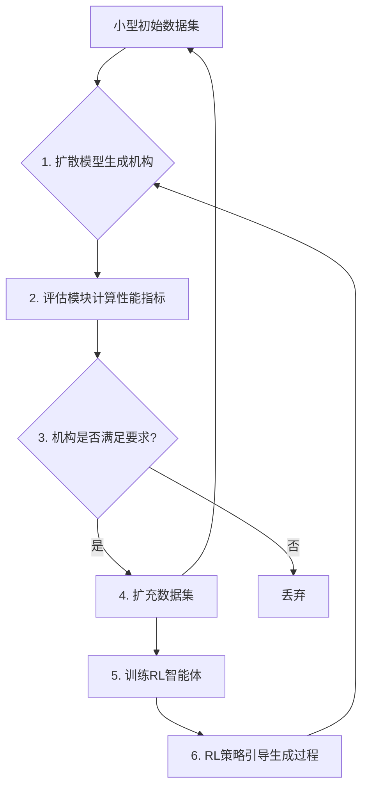

# GenRLMechSyn

[](https://opensource.org/licenses/MIT)

**GenRLMechSyn**: **Gen**erative **R**einforcement **L**earning for **Mech**anism **Syn**thesis.

本项目旨在探索一种全新的机构综合设计范式。我们结合了**扩散模型 (Diffusion Model)** 的强大生成能力和**强化学习 (Reinforcement Learning)** 的智能引导策略，构建一个能够自我演化、自我迭代的机构设计系统。

## 核心思想 (Core Idea)

传统的机构设计依赖于大量的专家知识库或庞大的初始数据集。本项目的核心思想是通过一个“生成-评估-扩充-引导”的闭环，从一个非常小型的种子数据集出发，逐步探索并发现满足特定性能要求的新颖机构。

这个过程如同一个不断进化的“虚拟设计师”：

1.  **生成 (Generation)**: 扩散模型根据现有的（最初很少的）数据集，生成一批全新的、多样化的机构拓扑和尺寸。
2.  **评估 (Evaluation)**: 一个预设的评估模块根据一系列关键性能指标（如运动学精度、动力学性能、结构紧凑性等）对新生成的机构进行“打分”。
3.  **扩充 (Augmentation)**: 只有那些得分高、满足设计要求的“优秀”机构才会被筛选出来，并加入到原始数据集中，使其规模和质量都得到提升。
4.  **引导 (Guidance)**: 与此同时，一个强化学习智能体（Agent）被训练。它的“任务”是引导扩散模型的生成过程，其“奖励”则来自于评估模块的打分。通过训练，RL智能体学会如何指导扩散模型产出更高质量的机构，从而提高筛选的效率。

这个自我完善的循环使得整个系统能够持续地进行数据增强和策略优化，最终实现在广阔的设计空间中高效地进行机构综合设计。

## 工作流程 (Workflow)



## 主要特点 (Key Features)

* **自举学习 (Bootstrapping)**: 无需大规模初始数据集，可从少量样本启动。
* **数据自我增强 (Self-Augmentation)**: 自动扩充高质量数据，形成良性循环。
* **智能引导生成 (RL-Guided Generation)**: 告别盲目生成，由RL策略引导模型产出更优设计。
* **高度可扩展**: 评估指标和RL奖励函数可以根据不同的设计任务灵活定制。

## 项目结构 (Project Structure)

```
GenRLMechSyn/
│
├── data/
│   ├── initial_dataset/      # 存放初始的种子数据集
│   └── augmented_dataset/    # 存放扩充后的数据集
│
├── src/
│   ├── diffusion_model/      # 扩散模型的相关代码
│   ├── rl_agent/             # 强化学习智能体的代码
│   ├── evaluator/            # 机构性能评估模块
│   ├── utils/                # 工具函数
│   └── pipeline.py           # 核心工作流的编排脚本
│
├── configs/
│   └── default_config.yaml   # 存放超参数和配置
│
├── scripts/
│   ├── train.py              # 主训练脚本
│   └── generate.py           # 用于生成新机构的脚本
│
├── requirements.txt          # 项目依赖
└── README.md                 # 项目说明文档
```

## 安装与使用 (Installation & Usage)

1.  **克隆本仓库**
    ```bash
    git clone [https://github.com/YourUsername/GenRLMechSyn.git](https://github.com/YourUsername/GenRLMechSyn.git)
    cd GenRLMechSyn
    ```

2.  **创建虚拟环境并安装依赖**
    ```bash
    python -m venv venv
    source venv/bin/activate  # On Windows use `venv\Scripts\activate`
    pip install -r requirements.txt
    ```

3.  **开始训练**
    ```bash
    python scripts/train.py --config configs/default_config.yaml
    ```

## 发展路线图 (Roadmap)

-   [ ] 搭建基础的扩散模型用于机构生成。
-   [ ] 定义第一版机构性能评估指标。
-   [ ] 实现核心的“生成-评估-扩充”循环。
-   [ ] 集成强化学习模块以引导生成过程。
-   [ ] 进行实验并验证方法的有效性。
-   [ ] 探索更复杂的评估指标和奖励函数。

## 许可证 (License)

This project is licensed under the MIT License. See the [LICENSE](LICENSE) file for details.
