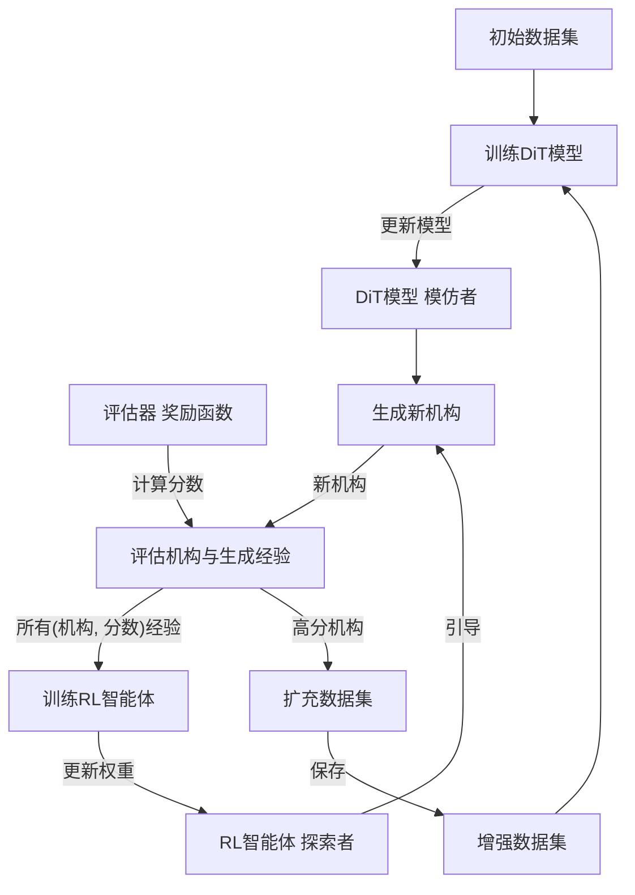

# GenRLMechSyn: 项目介绍 & 技术路线图

**版本:** 1.1
**日期:** 2025年11月
**状态:** 5通道架构 (含关节类型推断)

## 1. 项目愿景与目标

**GenRLMechSyn** (Generative Reinforcement Learning for Mechanism Synthesis) 项目旨在利用最前沿的人工智能技术，彻底改变传统机械机构的设计范式。

**痛点:** 传统的机构综合方法往往依赖于繁琐的数学推导、有限的设计库或大量的专家经验，难以高效地探索广阔的设计空间并发现真正新颖、高性能的机构。

**我们的愿景:** 构建一个能够**自主学习、自我演化、持续探索**的AI系统。该系统能够：
* 从极少量（甚至零）的初始样本出发。
* 利用生成模型（Diffusion Model）创造多样化的机构候选方案。
* 通过基于物理规则和性能指标的评估（奖励函数），筛选出有效的机构。
* 利用强化学习（RL）智能地引导生成过程，使其更倾向于产生高质量、满足特定要求的设计。
* 最终实现机构设计的自动化和智能化，加速创新过程。

**核心目标:** 开发并验证一个结合了**扩散模型 (DiT)** 和**强化学习 (RL)** 的闭环框架，用于高效、可控的机构综合设计。

## 2. 核心概念：模仿者-探索者 (Mimic-Explorer) 架构

本项目采用了一种“双引擎”协同工作的架构：

* **模仿者 (Mimic Engine): DiT + MSE 损失**
    * **角色:** “画师”或“结构学习者”。
    * **技术:** 基于当前SOTA的 **Diffusion Transformer (DiT)** 架构。
    * **目标:** **保真度 (Fidelity)**。通过`MSE`损失函数，学习训练数据集中所有*已知有效*机构的底层表示（像素/体素级分布）。它负责确保生成的机构在“形态”上是合理的、平滑的、有结构的。
    * **能力升级:** 在 v1.1 版本中，模仿者不仅学习几何参数，还能**自动推断关节类型（R副或P副）**。

* **探索者 (Explorer Engine): RL Agent + Evaluator**
    * **角色:** “向导”或“物理学家”。
    * **技术:** 一个**奖励预测模型**（基于Transformer）作为`RL智能体`，以及一个**动态的、可配置的`评估器`**作为奖励函数。
    * **目标:** **有效性 (Validity) & 优化 (Optimization)**。`评估器`根据通用的物理规则（如自由度DoF=1）和特定的设计偏好（如全R副约束、拓扑相似性）给机构打分。`RL智能体`学习预测这个分数，并提供“引导梯度”，在DiT生成过程中“推动”其朝向更高分的方向探索。

## 3. 系统架构与工作流程

系统通过一个**三步循环**进行迭代优化：

1.  **[引导生成 (Guided Generation)]**: `DiT`（模仿者）在 `RL智能体`（探索者）提供的**引导梯度** (`guidance_fn`) 的影响下，从噪声开始采样，生成一批新的机构张量。
2.  **[评估与训练RL (Evaluate & Train RL)]**:
    * 新生成的机构（未归一化）被送入 `Evaluator`（裁判）计算总奖励分数 (`R_total`)。
    * 所有生成的 `(机构_归一化, 分数)` 数据被视为新的经验，用于**训练 `RL智能体`**（奖励预测模型），使其预测更准确，“引导”更有效。
3.  **[扩充与训练DiT (Augment & Train DiT)]**:
    * 在“步骤2”中获得高分（超过`acceptance_threshold`）的机构被**批准**，其（未归一化的）数据被保存到 `augmented_dataset` 中。
    * 然后，`DiT`（模仿者）在这个更新的、更大的数据集上进行标准的`MSE`去噪训练，学习模仿这些新批准的有效机构。

## 4. 数据表示法：`(N, N, 5)` 特征张量 (v1.1 新增)

为了同时表示拓扑结构、几何参数以及**关节类型**，我们采用了升级版的 **5通道** 稠密张量表示法。

* **形状**: `(N, N, 5)`，其中 `N = max_nodes` (e.g., `6`)。
* **通道**: `[exists, joint_type, a, alpha, offset]`
    * **通道 0: `exists` (存在性)**
        * `1.0`: 表示连接存在。
        * `0.0`: 表示连接不存在。
        * *性质*: 对称矩阵 ($M_{ij} = M_{ji}$)，对角线为 0。
    * **通道 1: `joint_type` (关节类型 - 节点属性)**
        * `+1.0`: 表示 **R副 (旋转副)**。
        * `-1.0`: 表示 **P副 (移动副)**。
        * `0.0`: 表示无定义。
        * *性质*: **行属性一致**。即第 `i` 行的所有元素 `tensor[i, :, 1]` 表示节点 `i` 的类型。例如，`tensor[i, k, 1]` 和 `tensor[i, j, 1]` 均为节点 `i` 的类型。
    * **通道 2: `a` (连杆长度)**
        * 物理意义: 连杆公垂线长度 (`>= 0`)。
        * *性质*: 对称矩阵，对角线为 0。
    * **通道 3: `alpha` (连杆扭转角)**
        * 物理意义: 连杆扭转角 (`[0, pi/2]`)。
        * *性质*: 对称矩阵，对角线为 0。
    * **通道 4: `offset` (轴向偏移量)**
        * 原名: `d`。
        * 物理意义: 连杆在**源节点**轴上的偏移量 (`>= 0`)。
        * *性质*: 非对称矩阵 ($M_{ij} \neq M_{ji}$)，对角线为 0。

* **归一化策略**:
    * `exists`: `0/1 -> -1/1`
    * `joint_type`: 已经是 `-1/+1`，不进行缩放。
    * `a, alpha, offset`: 线性缩放到 `[-1, 1]`。

## 5. 技术实现细节

* **核心框架:** Python, PyTorch
* **生成模型:** Diffusion Transformer (DiT)，输入通道数 `in_channels=5`。
* **强化学习:** 基于奖励预测模型的策略梯度引导。
* **评估与奖励:** * 升级了 `Bennett` 检查逻辑，现在会明确检查 `joint_type` 通道是否全为 `+1.0` (R副)。
    * 支持对角线掩码 (Diagonal Masking) 和对称性强制 (Symmetry Enforcement) 以保证物理合理性。
* **数据处理:** * 支持 8 列稀疏格式 (`i, k, a, alpha, offset_i, offset_k, type_i, type_k`) 与 5 通道稠密张量的自动转换。
    * `Dataloader` 自动处理关节类型的行广播逻辑。

### 文件说明 (File Descriptions)

* **`configs/default_config.yaml`**:
    * **修改**: `in_channels` 设置为 `5`。归一化参数中 `d` 对应 `offset` 通道。

* **`src/diffusion_model/model.py`**:
    * **修改**: `sample` 函数增加了特殊的后处理步骤：
        * 对 `exists`, `a`, `alpha` 进行对称化。
        * 对 `joint_type` 进行**行均值化**处理，确保节点属性的一致性。
        * 对除 `joint_type` 外的所有通道强制对角线为 0。

* **`src/utils/dataloader.py`**:
    * **修改**: `__getitem__` 逻辑更新，加载时会将单个节点的关节类型填充到张量的整行中。

* **`src/evaluator/evaluator.py`**:
    * **修改**: `_check_is_bennett` 等函数现在直接从节点行属性中读取关节类型，无需遍历邻居。

## 6. 当前状态与挑战

* **已完成:**
    * **5通道架构升级**: 成功引入 `joint_type` 通道，支持 R/P 副的混合生成。
    * **节点属性逻辑**: 解决了 `joint_type` 作为节点属性在张量中的表示和采样一致性问题。
    * **物理约束强化**: 在采样阶段加入了对称性强制和对角线清零（智能避开 `joint_type`），消除了物理上无意义的自环。
* **当前挑战:**
    * **RL 训练稳定性:** RL智能体在初始阶段可能因奖励信号稀疏而难以学习。
    * **P副机构生成:** 目前数据集主要是 R 副机构，生成混合副机构需要更复杂的引导或数据支持。

## 7. 协作指南 & 快速开始

*(与 v1.0 保持一致，请参考原文档)*

1.  **配置**: 确保 `configs/default_config.yaml` 中 `diffusion_model.in_channels` 为 `5`。
2.  **数据**: 运行 `create_mechanism_data.py` 生成新的包含关节类型的初始数据。
3.  **运行**: `python scripts/train.py`
4.  **准备数据:** `python data_preparation/create_mechanism_data.py`
5.  **配置实验:** 编辑 `configs/default_config.yaml` (特别是 `device`, `enable_...` 开关)。
6.  **运行训练:** `python scripts/train.py`

欢迎加入 GenRLMechSyn 项目，让我们一起用 AI 探索机构设计的未来！
